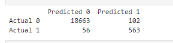
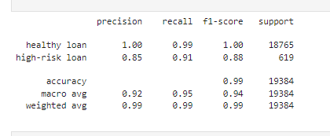

<h1 align="center">Loan Risk Analysis Report </h1>
<h3 align="center">Predict the loan applicant pay back risk</h3>

	

## Overview of the Analysis:
This report evaluates machine learning models used to assess loan bay back risk, focusing on identifying the most reliable model for predicting loan default risks. Effective credit risk assessment is critical for financial institutions to make informed lending decisions and minimize potential losses.

## Objective: 
The analysis seeks to determine how well various models can predict whether a loan applicant will default or not. Accurate predictions help in managing lending risks and preventing financial setbacks.

## Data Context and Prediction Goal:
- Dataset:
The dataset includes various financial features of loan applicants. The primary task is to classify applicants as either high-risk  (likely to default) or low risk (likely to repay successfully). Understanding these classifications helps in making better credit decisions.
- Dataset Variables:
 Key variables in the dataset are used to predict loan outcomes. The classification problem involves distinguishing between two main categories: healthy loan (0) and high-risk loan (1). The distribution of these categories provides insight into the data balance.

## Machine Learning Process:
- Data Preparation:
Since having clean data set , there is no need to clean or addressing the missing values. Further, since all data are numeric there is no need to encoding categorical data. 
- Model Selection: 
Various algorithms are considered for classification, including logistic regression and decision trees, to find the best fit for the data. In this analysis, “LogisticRegression” is used to develop the analysis model as a continuous value is predicted.
- Model Training: 
Models are trained using the prepared data to learn the patterns associated with loan default. In this analysis available data are divided into training and testing by using the train_test_split which is available in sklearn.model_selection library.
- Model Evaluation: 
Performance metrics such as accuracy, precision, and recall are used to assess the models on a test set.

## Results:

### confusion matrix:

	

### classification report:

	

## Summary:
The analysis demonstrates that the evaluated model performs exceptionally well:

- Top Model:
The model achieving 99% accuracy is noted for its strong performance. It shows high precision for healthy loans and good recall for high-risk loans, indicating reliable predictions for both types of outcomes.

- Performance Insights: 
The model's ability to accurately identify both high-risk (1) and healthy loans(0) is crucial for effective credit risk management. Although the precision for high-risk loans could be improved, the overall performance supports its use in making informed lending decisions.

- Recommendation: 
Based on its high accuracy and balanced recall rates, this model is recommended for credit risk assessment. Enhancing its precision for high-risk loans could further improve its effectiveness, but it remains a strong tool for evaluating loan applications.

